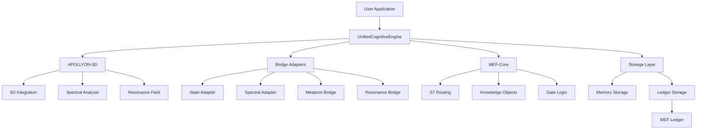
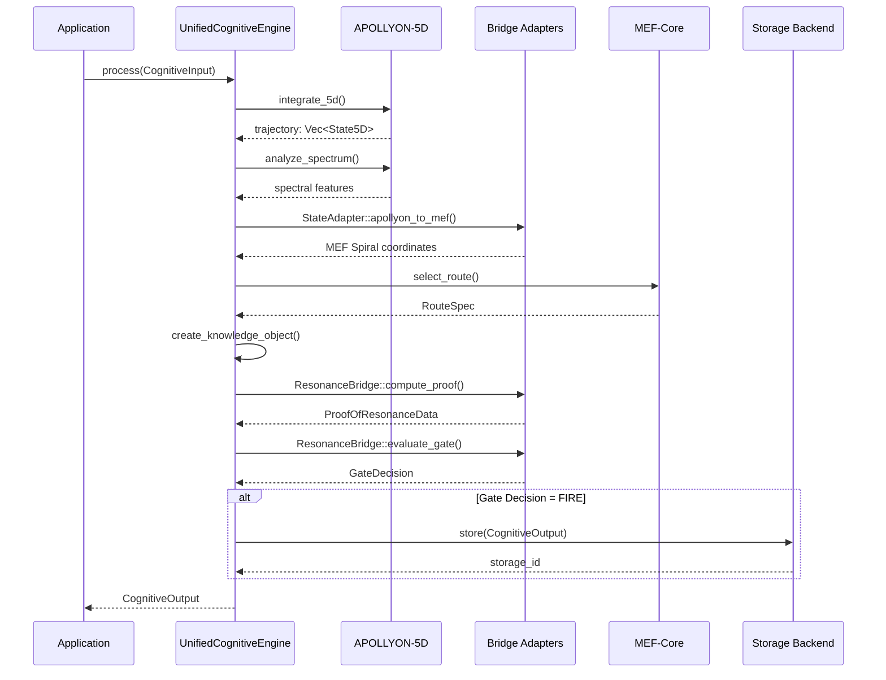
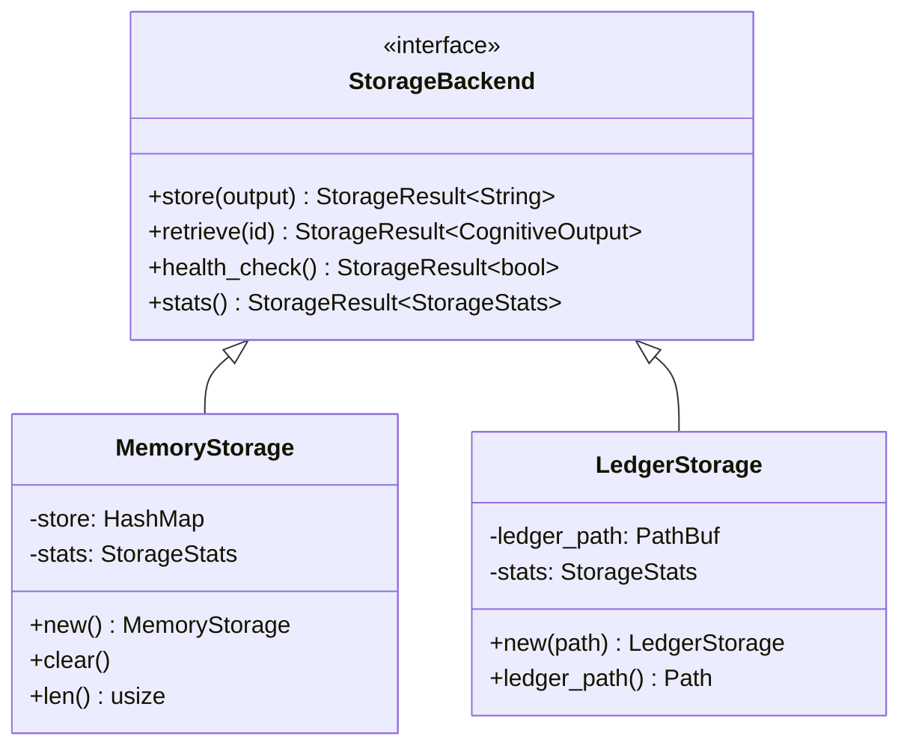
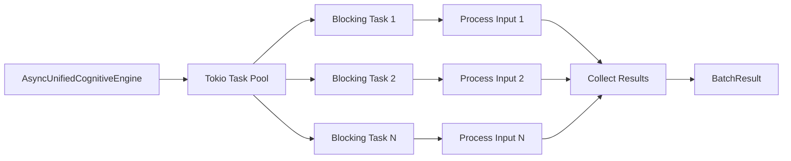
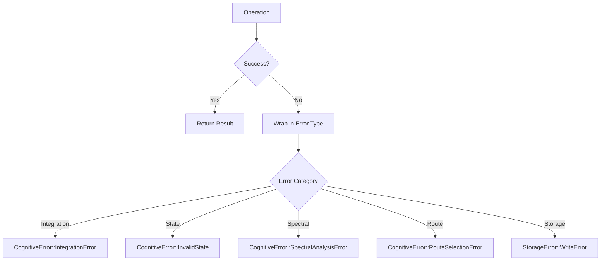

# APOLLYON-MEF Bridge Architecture

## System Overview



## Component Architecture

### Core Components

```
┌─────────────────────────────────────────────────────────────────┐
│                   APOLLYON-MEF Bridge                             │
├─────────────────────────────────────────────────────────────────┤
│                                                                   │
│  ┌───────────────────────────────────────────────────────────┐  │
│  │           Unified Cognitive Engine                        │  │
│  │  ┌────────────────────────────────────────────────────┐   │  │
│  │  │  Configuration Layer                               │   │  │
│  │  │  • GateConfig                                      │   │  │
│  │  │  • ResonanceField                                  │   │  │
│  │  │  • SystemParameters                                │   │  │
│  │  └────────────────────────────────────────────────────┘   │  │
│  │                                                            │  │
│  │  ┌────────────────────────────────────────────────────┐   │  │
│  │  │  Processing Pipeline (8 Phases)                    │   │  │
│  │  │  1. APOLLYON Integration                           │   │  │
│  │  │  2. Spectral Analysis                              │   │  │
│  │  │  3. State Conversion                               │   │  │
│  │  │  4. Route Selection                                │   │  │
│  │  │  5. Knowledge Derivation                           │   │  │
│  │  │  6. Proof-of-Resonance                             │   │  │
│  │  │  7. Gate Evaluation                                │   │  │
│  │  │  8. Storage (conditional)                          │   │  │
│  │  └────────────────────────────────────────────────────┘   │  │
│  └───────────────────────────────────────────────────────────┘  │
│                                                                   │
│  ┌───────────────────────────────────────────────────────────┐  │
│  │           Bridge Adapters                                 │  │
│  │  • StateAdapter: 5D ↔ Spiral conversion                  │  │
│  │  • SpectralAdapter: Features → MEF signature             │  │
│  │  • MetatronBridge: APOLLYON-enhanced routing             │  │
│  │  • ResonanceBridge: PoR computation & gate evaluation    │  │
│  └───────────────────────────────────────────────────────────┘  │
│                                                                   │
│  ┌───────────────────────────────────────────────────────────┐  │
│  │           Storage Backends                                │  │
│  │  • MemoryStorage: In-memory for dev/test                 │  │
│  │  • LedgerStorage: Persistent MEF Ledger                  │  │
│  └───────────────────────────────────────────────────────────┘  │
│                                                                   │
│  ┌───────────────────────────────────────────────────────────┐  │
│  │           Async Support                                   │  │
│  │  • AsyncUnifiedCognitiveEngine                           │  │
│  │  • Parallel batch processing                             │  │
│  │  • Tokio runtime integration                             │  │
│  └───────────────────────────────────────────────────────────┘  │
└─────────────────────────────────────────────────────────────────┘
```

## Processing Pipeline Flow



## Data Flow

### Input Data Flow

```
CognitiveInput
├── initial_state: State5D (x, y, z, ψ, ω)
├── parameters: SystemParameters (κ, γ, Φ₀, ε)
├── t_final: f64
├── tic_id: String
├── seed: String
└── seed_path: String
                │
                ▼
        [ Integration ]
                │
                ▼
        Vec<State5D> (trajectory)
                │
                ▼
        [ Spectral Analysis ]
                │
                ▼
        SpectralSignature (ψ, ρ, ω)
```

### Output Data Flow

```
CognitiveOutput
├── trajectory: Vec<State5D>
├── spectral_signature: SpectralSignature
├── route: RouteSpec
├── proof: ProofOfResonanceData
├── gate_decision: GateDecision
└── knowledge: Option<KnowledgeObject>
                │
                ▼
        [ Storage Backend ]
                │
                ├─► MemoryStorage (HashMap)
                └─► LedgerStorage (MEF Ledger)
```

## Adapter Architecture

### State Adapter

```
┌─────────────────────────────────────────────────────┐
│              State Adapter                          │
├─────────────────────────────────────────────────────┤
│                                                     │
│  APOLLYON-5D                     MEF Spiral         │
│  ───────────                     ──────────         │
│  x, y, z, ψ, ω          ←→       Vec<f64>[5]       │
│                                                     │
│  Perfect 1:1 mapping                                │
│  Roundtrip error < 1e-10                            │
│                                                     │
└─────────────────────────────────────────────────────┘
```

### Spectral Adapter

```
┌─────────────────────────────────────────────────────┐
│            Spectral Adapter                         │
├─────────────────────────────────────────────────────┤
│                                                     │
│  Trajectory Features        MEF Signature           │
│  ──────────────────         ─────────────           │
│  entropy                →   ψ (psi)                 │
│  centroids              →   ρ (rho)                 │
│  dominant_frequency     →   ω (omega)               │
│                                                     │
│  Normalization: ρ = 1 / (1 + entropy)               │
│                                                     │
└─────────────────────────────────────────────────────┘
```

### Metatron Bridge

```
┌─────────────────────────────────────────────────────┐
│            Metatron Bridge                          │
├─────────────────────────────────────────────────────┤
│                                                     │
│  APOLLYON State        MEF Route Selection          │
│  ──────────────        ──────────────────           │
│                                                     │
│  State5D  ──→  Topological      ──→  RouteSpec      │
│                Mesh Metrics                         │
│                                                     │
│  • Compute connectivity score                       │
│  • SHA256 deterministic hash                        │
│  • Select S7 permutation                            │
│                                                     │
└─────────────────────────────────────────────────────┘
```

### Resonance Bridge

```
┌─────────────────────────────────────────────────────┐
│           Resonance Bridge                          │
├─────────────────────────────────────────────────────┤
│                                                     │
│  ResonanceField         Proof-of-Resonance          │
│  ──────────────         ──────────────────          │
│                                                     │
│  modulation(t, i, j) ──→  δPI (path invariance)    │
│                       ──→  Φ   (alignment)          │
│  state_prev, state_curr   δV  (Lyapunov delta)     │
│                                                     │
│  Gate Logic:                                        │
│  FIRE ⟺ (PoR valid) ∧ (δPI ≤ ε) ∧                  │
│         (Φ ≥ φ_threshold) ∧ (δV < 0)               │
│                                                     │
└─────────────────────────────────────────────────────┘
```

## Storage Architecture

### Storage Abstraction



### Ledger Storage Structure

```
ledger_path/
├── ledger_index.json           # Ledger metadata
├── MEF-TIC-001-ROUTE-001.json  # Knowledge block 1
├── MEF-TIC-002-ROUTE-003.json  # Knowledge block 2
└── MEF-TIC-003-ROUTE-002.json  # Knowledge block 3
```

## Async Architecture

### Async Engine Flow



### Parallelism Model

```
┌────────────────────────────────────────────────────┐
│         Async Batch Processing                     │
├────────────────────────────────────────────────────┤
│                                                    │
│  Inputs [1, 2, 3, ..., N]                         │
│     │                                              │
│     ▼                                              │
│  Chunk by parallelism limit                       │
│     │                                              │
│     ├─► Chunk 1 [1..P]  ──→  Process in parallel  │
│     │                                              │
│     ├─► Chunk 2 [P+1..2P] ──→ Process in parallel │
│     │                                              │
│     └─► Chunk N [...]  ──→  Process in parallel   │
│                                                    │
│  Collect all results → BatchResult                │
│                                                    │
└────────────────────────────────────────────────────┘

Where P = parallelism (default: num_cpus)
```

## Configuration Architecture

### Gate Configuration

```
GateConfig
├── epsilon: f64              (path invariance threshold)
├── phi_threshold: f64        (alignment threshold)
└── resonance_strength: f64   (field strength)
    │
    ├─► default()    : (0.1, 0.5, 0.8)
    ├─► strict()     : (0.05, 0.7, 0.9)
    └─► relaxed()    : (0.2, 0.3, 0.6)
```

### Resonance Field Hierarchy

```
ResonanceField (trait)
├── ConstantResonanceField
│   └── modulation = constant
├── OscillatoryResonanceField
│   └── modulation = 1 + A·sin(2πft + φ)
└── Custom implementations
    └── modulation = user-defined
```

## Error Handling

### Error Propagation



## Thread Safety

### Synchronous Engine

```
UnifiedCognitiveEngine
├── NOT thread-safe (requires &mut self)
└── Use separate instances per thread
```

### Async Engine

```
AsyncUnifiedCognitiveEngine
├── Clones engine per task
├── Each task has isolated state
└── Thread-safe via tokio::spawn_blocking
```

### Storage Backends

```
MemoryStorage
├── Arc<RwLock<HashMap>>
└── Thread-safe, concurrent reads

LedgerStorage
├── File system access
└── Thread-safe via OS file locks
```

## Performance Characteristics

### Time Complexity

| Operation | Complexity | Notes |
|-----------|-----------|-------|
| integrate_5d | O(n) | n = number of time steps |
| analyze_spectrum | O(n) | n = trajectory length |
| select_route | O(1) | SHA256 + permutation lookup |
| compute_proof | O(1) | Fixed calculations |
| evaluate_gate | O(1) | Simple boolean logic |
| process_batch | O(m) | m = batch size (sequential) |
| process_batch_parallel | O(m/p) | p = parallelism |

### Space Complexity

| Component | Memory Usage |
|-----------|-------------|
| State5D | 40 bytes |
| Trajectory (100 states) | ~4 KB |
| CognitiveOutput | ~4-40 KB |
| Batch (100 outputs) | ~400 KB - 4 MB |

## Integration Points

### External Systems

```
┌──────────────────────────────────────────────┐
│         External Integration Points          │
├──────────────────────────────────────────────┤
│                                              │
│  APOLLYON-5D                                 │
│  ├─ core_5d: State5D, VectorField           │
│  ├─ metatron: Topological routing            │
│  └─ bridge: ResonanceField, SpectralAnalyzer │
│                                              │
│  MEF-Core                                    │
│  ├─ mef-schemas: Types, validation           │
│  ├─ mef-router: S7 routing                   │
│  └─ mef-ledger: Persistent storage           │
│                                              │
│  Runtime                                     │
│  ├─ tokio: Async runtime                     │
│  └─ rayon: Data parallelism (optional)       │
│                                              │
└──────────────────────────────────────────────┘
```

## Extension Points

### Custom Resonance Fields

```rust
impl ResonanceField for MyCustomField {
    fn modulation(&self, t: f64, i: usize, j: usize) -> f64 {
        // Custom logic
    }
}

let field = Box::new(MyCustomField::new());
let engine = UnifiedCognitiveEngine::new_with_field(field);
```

### Custom Storage Backends

```rust
#[async_trait]
impl StorageBackend for MyStorage {
    async fn store(&mut self, output: &CognitiveOutput)
        -> StorageResult<String> {
        // Custom storage logic
    }
    // ... other methods
}
```

## Design Patterns

### Builder Pattern

```rust
// GateConfig builder
let config = GateConfig::new(0.1, 0.5, 0.8);

// Engine builder
let engine = UnifiedCognitiveEngine::new_with_components(
    config,
    resonance_field
);
```

### Strategy Pattern

```rust
// Storage strategy
let storage: Box<dyn StorageBackend> = if production {
    Box::new(LedgerStorage::new(path)?)
} else {
    Box::new(MemoryStorage::new())
};
```

### Pipeline Pattern

```rust
// 8-phase processing pipeline
Input → Integration → Spectral → Conversion → Routing
    → Knowledge → PoR → Gate → Storage → Output
```

## Security Considerations

### Data Integrity

- SHA256 hashing for deterministic routing
- Cryptographic verification in MEF Ledger
- Immutable ledger blocks

### Input Validation

- State validity checks at each integration step
- PoR validation before gate evaluation
- JSON schema validation for MEF objects

### Access Control

- File system permissions for ledger storage
- No network access (all local operations)
- No sensitive data in logs (configurable)

## Future Architecture

### Planned Extensions

1. **Distributed Processing**
   - Multi-node batch processing
   - Shared ledger storage
   - Consensus mechanisms

2. **Real-time Streaming**
   - Continuous input processing
   - Incremental trajectory updates
   - Event-driven architecture

3. **GPU Acceleration**
   - CUDA/OpenCL integration
   - Batch spectral analysis
   - Parallel trajectory integration

4. **Advanced Caching**
   - Route cache for common patterns
   - Precomputed field modulations
   - Trajectory compression
